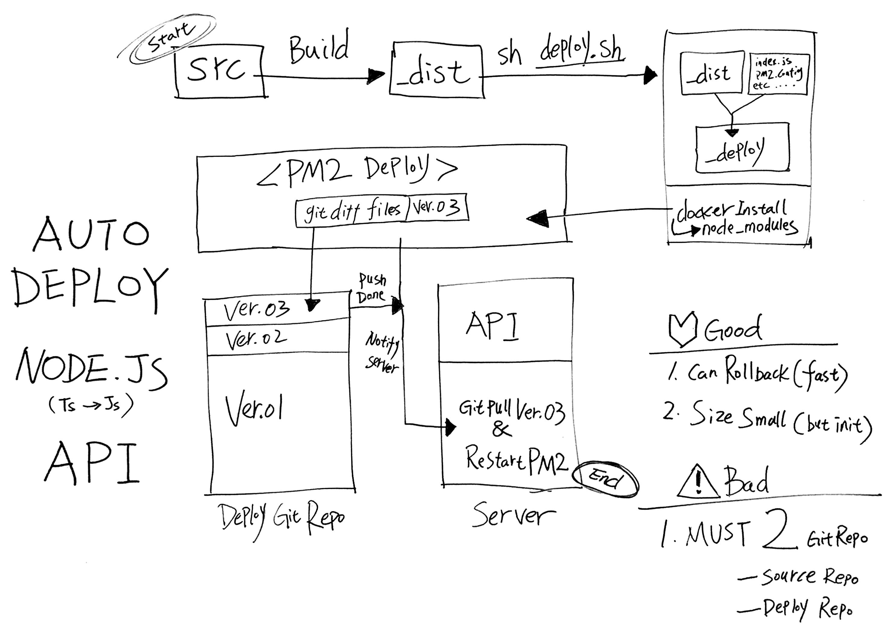

## Leaa Api

### Introduction

leaa-api is an Api of leaa, base [Nest.js](https://github.com/nestjs/nest) framework.

### Get Started

Install the latest version via npm or yarn

```shell script
# .env for development
cp .env.example .env.development

# .env for production
cp .env.example .env

yarn insatll

# fill init database
yarn seed --nuke
yarn dev
```

### Database

leaa-api uses `mysql` driver, and I recommended to use mysql at `docker`, [dockerrr](https://github.com/SolidZORO/dockerrr) is a docker scaffolding that I used when developing leaa-api.

### Tips

Starting from `v1.0.4`, the api also supports `i18n`.

The currently available languages are 🇺🇸 English (en-US) and 🇨🇳 Chinese (zh-CN). The default is English. to request Chinese, please set req.header.lang, e.g. `req.heard.lang = 'zh-CN'`

### Deploy

More detailed you can see `./deploy-api.sh`

目前这边是自动化部署的一些不成熟的思路记录。(🇨🇳 ONLY now)

来， 先上草图 draft：



#### 需求

理论上可以在 CI/CD 上自动部署，但是我想

- 不装 Jenkins（服务器上）
- 有 Version 控制，可以 rollback
- 可以同时部署到多台机器上
- 尽可能简单

所以我觉得，用一个专有的 Git Repo 去作为部署跳板这里叫 Deploy Repo，这个 Deploy Repo 可以由 PM2 控制。PM2 天然支持多 hosts 部署，而且有很好的 Rollback 支持。

重要的是，这个 Deploy Repo 虽然接受所有 node_modules 文件，第一次 git push 会很慢，但因为有 git diff 算法的支持，后面再次更新 yarn add package，node_modules 并不会增加太多文件，所以网络传输时间完全可以忽略不计。并且因为是独立的 Git Repo，可以很方便的做到 Rollback，就 git checkout 一样简单可靠。

抛开 Deploy Repo 不谈，其实 PM2 也是支持多版本 Rollback 的，但他是以`多文件夹`形式存在的，如果每个版本都有自己的文件夹，那么势必会有 `node_modules`，那这样每个文件夹就会变得很大，最终权衡下来，还是使用独立的 Deploy Repo 配合 PM2 管理版本。

#### 步骤

建议使用 `sh ./deploy-api.sh -p docker_install` 把项目打包到 `_deploy` 目录并在 docker 里面安装好所有 `node_modules`。

然后用 PM2 直接 Deploy，比如 `pm2 deploy api`，然后想要 Rollback 就直接输入 e.g. `pm2 deploy api revert 4d2c-hash-0582` 就可以马上回滚到指定版本。

PM2 更多命令请看 https://pm2.keymetrics.io/docs/usage/pm2-doc-single-page/ ，我在 production 环境下的 `package.json` 里也暴露了 pm2 的 script，只要用 `docker exec -it prod_api sh`，进到 docker 中，然后 `yarn pm2 -h` 就可以使用 pm2 的所有命令。

Q 为什么不直接 `pm2 -h` 来运行 pm2 呢？

A 因为容器中并没有全局安装 pm2

### TODO

- [ ] Auto Deploy in CI / CD
